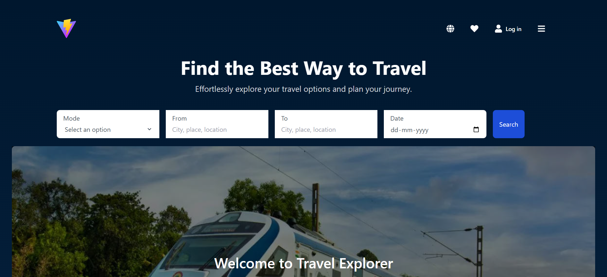
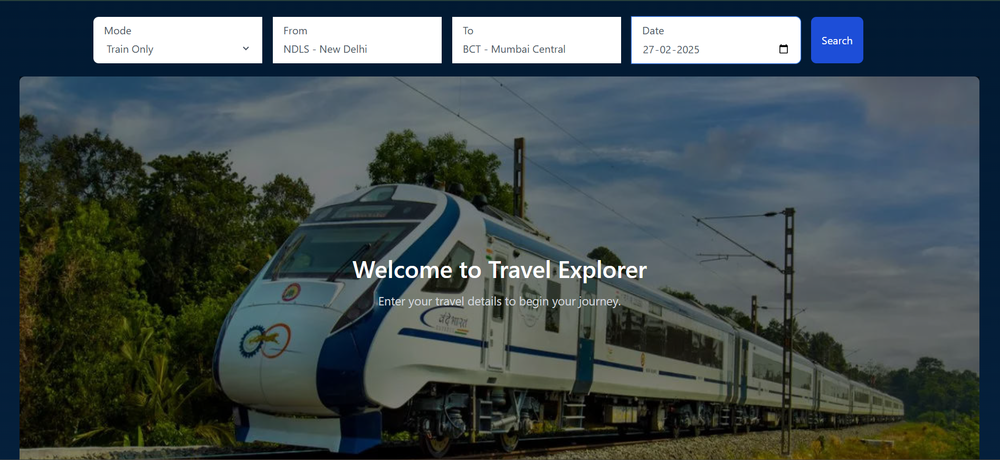
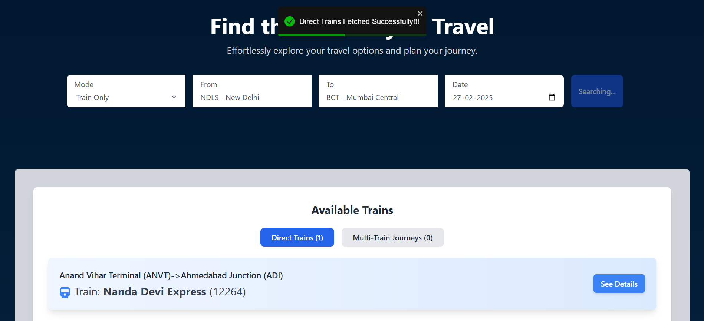
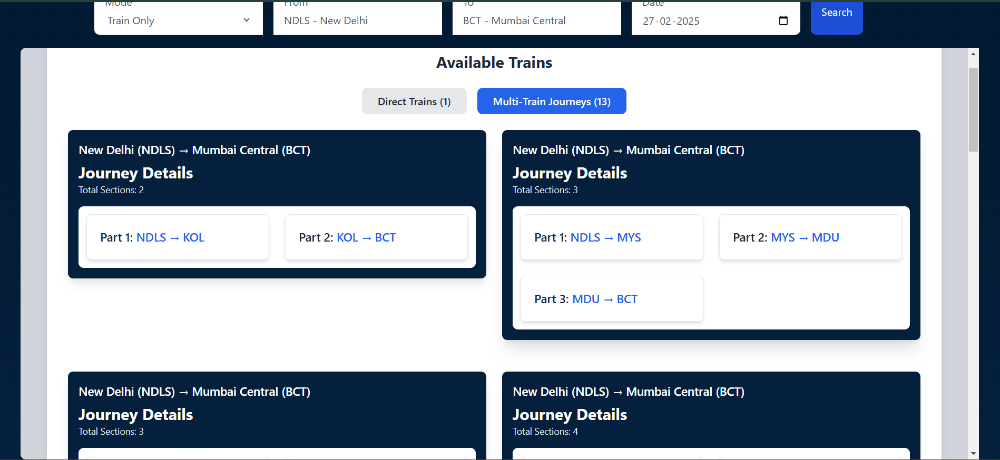
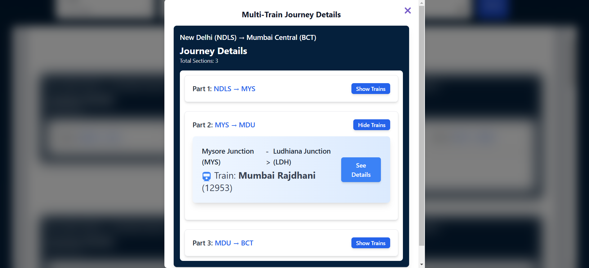
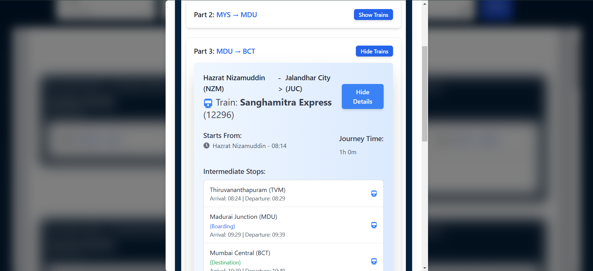
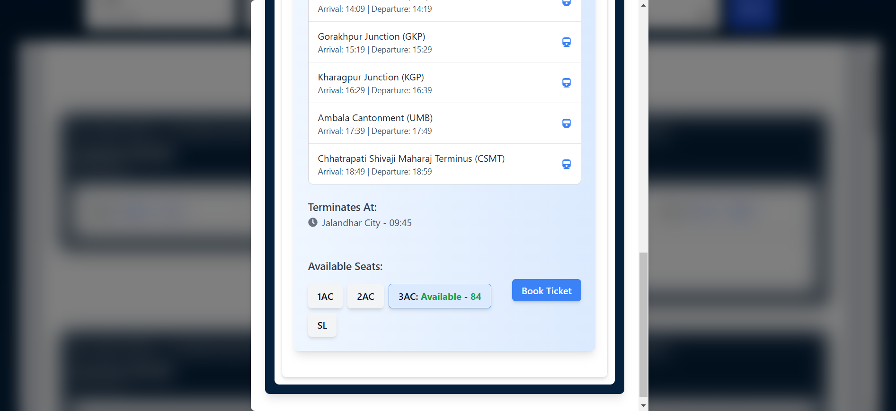

# 🚆 Train Search Platform

The **Train Search Platform** is a web-based application that allows users to search for train availability, including direct and multi-train routes. It simplifies route planning by automatically finding the best options, displaying available seats, and estimating travel time.


## 🌟 Features

- 🔍 **Train Search**: Find direct and multi-train routes between stations.
- 🔄 **Multi-Train Route Optimization**: Automatically suggests the best possible route with multiple trains if no direct train is available.
- 🏷 **Seat Availability**: Displays available seats for each train option.
- ⏳ **Estimated Travel Time**: Provides an estimated duration for the selected route.
- 🗺 **User-Friendly Interface**: Simple and easy-to-use UI for quick searches.
- **Optimized Performance with Indexing**  
  - Implemented database indexing to speed up query execution.  
  - Ensures faster data retrieval for frequently accessed records.  
- **Faster Data Streaming with SSE (Server-Sent Events)**  
  - Instead of waiting for the entire dataset, results are sent one by one.  
  - Improves user experience by displaying data as soon as it is available.  
  - Reduces client-side waiting time for large queries.  


## 📷 Screenshots










## 🌍 Live Demo  
🚀 **[Click here to visit the live site](https://train-ticket-rvn.vercel.app/)**


## 🛠 Tech Stack

- **Frontend**: React.js 
- **Backend**: Node.js, Express.js
- **Database**: MongoDB 
- **Real-Time**: Server-Sent Events (SSE) 
- **Optimization**: Database Indexing


## 🚀 Installation & Setup

### 1️⃣ Clone the Repository
```sh
git clone https://github.com/ABC11xyz/Train-Ticket.git
cd Train-Ticket
```  

### 2️⃣ Install Dependencies
 

#### For Backend:
```sh
cd Backend
npm install
npm run dev
``` 

#### For Frontend:
```sh
cd Frontend
npm install
npm run dev
```


## 📌 Usage
1. Enter the source and destination stations.
2. Click Search to find available routes.
3. View the direct and multi-train options.
4. Check seat availability and estimated travel time.
5. Choose the best-suited option for your journey.


## 🤝 Contributing
1. Fork the repository.
2. Create a new branch (feature-branch).
3. Make your changes and commit them.
4. Push the branch and create a Pull Request.